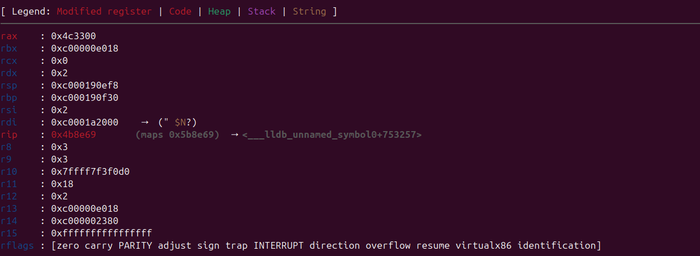
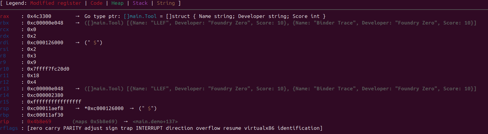
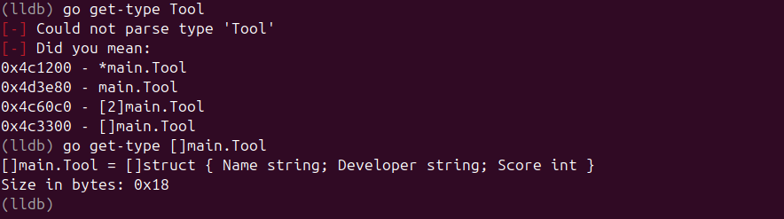
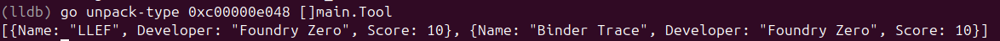
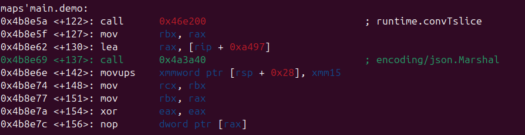
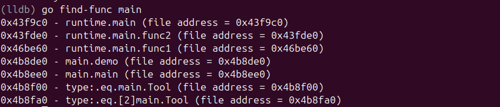
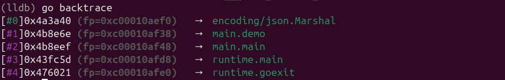
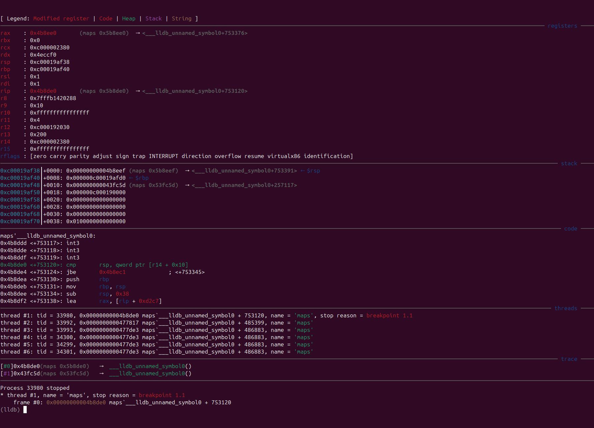
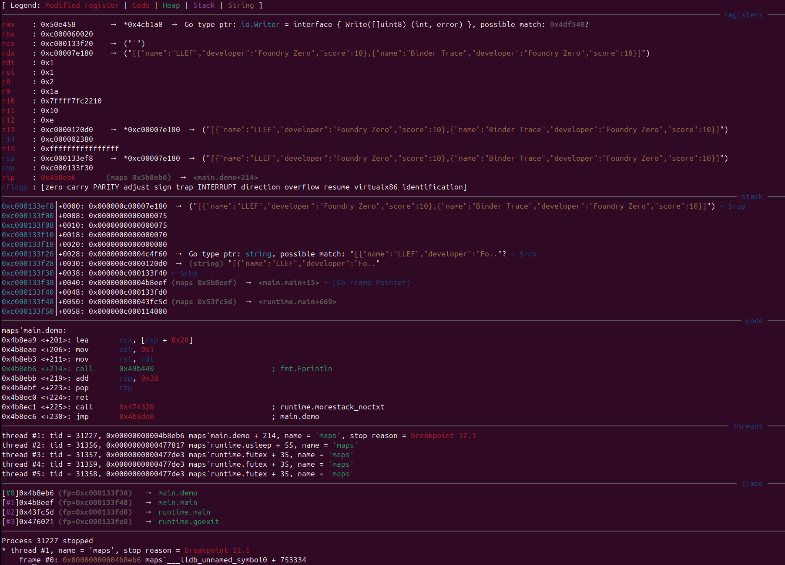

# LLEF Experimental Go Features Readme

LLEF now has experimental support for stripped Go binaries. This document contains examples of LLEF's Go features, including screenshots of what LLEF's analysis output displays compared with previous versions of LLEF. These features are tested across a range of Go versions since 1.7, which was released in 2016.

## Resolving and displaying Go types

Go binaries store metadata on complex data types which are used in the program, even when the binary has been stripped. From this metadata, field names and types can be recovered for `struct`, `map`, `array` and `slice` types. As an example, consider the following `struct` definition in a Go source file:

```go
type Tool struct {
    Name string `json:"name"`
    Developer string `json:"developer"`
    Score int `json:"score"`
}
func demo() {
    tools := []Tool{
        {Name: "LLEF", Developer: "Foundry Zero", Score: 10},
        {Name: "Binder Trace", Developer: "Foundry Zero", Score: 10},
    }
    jsonData, _ := json.Marshal(tools)
    fmt.Println(string(jsonData))
}
```

In the above program listing, `tools` is an `array` type of `Tool` objects, which is passed into `json.Marshal`. The definition of `json.Marshal` includes an `any` type for the input argument. To keep track of the input data type, the Go compiler loads a pointer to read-only metadata for the `[]Tool` data type at runtime, followed by a pointer to the raw object data in memory.

In previous versions of LLEF, when a breakpoint is set on the call to `json.Marshal`, the register view shows the following:



With Go features enabled, LLEF can now identify the pointer `0x4c3300` points to a data type definition for `[]Tool`, and used that definition to display the contents of the data pointer in `ebx`:



A new command `go get-type` has been added to find Go data type definitions present within the binary. When an argument is given to the command, LLEF will to match the name of the type to the definition present in the Go binary. If no match can be found, LLEF will display similar entries:



When no arguments are given, all data types are displayed.

If a data type pointer is not passed into a called function alongside the raw data type pointer, LLEF will not be able to determine the matching data type. In this case, an analyst can manually use the command `go unpack-type` to attempt to display a data pointer using a given data type definition. 



## Resolving Go Function Names

Go binaries store function symbols which are used during exception handling, even for stripped binaries. LLEF can now recover these function symbols and display them:



A new command `go find-func` has been added to search through function symbols, which is especially useful for finding where to set breakpoints. When no argument is given, all function symbols are displayed.



## Go call stack unwinding

LLEF can now display the Go call stack on x86 and x86_64 architectures. This is displayed in the listing view, but can also be displayed with the command `go backtrace`.



## Before and After

### Before



### After

