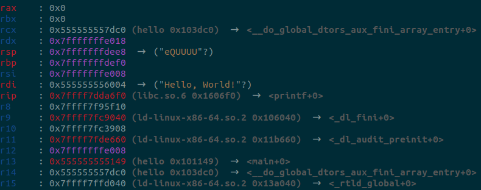

<p align="center">
  
</p>

# LLEF

LLEF (pronounced ɬɛf - "hlyeff") is an LLDB plugin to make it more usable for low-level RE and VR. Similar to [GEF](https://github.com/hugsy/gef), but for LLDB.

It uses LLDB's Python API to add extra status output and a few new commands, so that security researchers can more easily use LLDB to analyse software as it's running.


## 💻 Supported Architectures
* x86_64
* arm
* aarch64 / arm64
* i386
* PowerPC

## 📓 Requirements
* LLDB 15+ (https://apt.llvm.org/) _On macOS this is bundled with Xcode 14.3+_

## ⚙ Installation
The instructions below will install LLEF so that it is used by LLDB by default.

1. Clone the repository.
2. `cd <repo>`
3. Run `./install.sh`
4. Select automatic (overwrites `~/.lldbinit`) or manual installation.

_LLDB uses AT&T disassembly syntax for x86 binaries by default. The installer provides an option to override this._

## ▶ Usage

### Launch LLDB

```bash
lldb-15 <optional binary to debug>
```

### Use commands:

#### llefsettings
Various commands for setting, saving, loading and listing LLEF specific commands:
```
(lldb) llefsettings --help
list                list all settings
save                Save settings to config file
reload              Reload settings from config file (retain session values)
reset               Reload settings from config file (purge session values)
set                 Set LLEF settings
```

Settings are stored in a file `.llef` located in your home directory formatted as following:
```
[LLEF]
<llefsettings> = <value>
```

##### Available Settings

| Setting                 | Type    | Description                                        |
| ----------------------- | ------- | -------------------------------------------------- |
| color_output            | Boolean | Enable/disable color terminal output               |
| register_coloring       | Boolean | Enable/disable register coloring                   |
| show_legend             | Boolean | Enable/disable legend output                       |
| show_registers          | Boolean | Enable/disable registers output                    |
| show_stack              | Boolean | Enable/disable stack output                        |
| show_code               | Boolean | Enable/disable code output                         |
| show_threads            | Boolean | Enable/disable threads output                      |
| show_trace              | Boolean | Enable/disable trace output                        |
| force_arch              | String  | Force register display architecture (experimental) |
| rebase_addresses        | Boolean | Enable/disable address rebase output               |
| rebase_offset           | Int     | Set the rebase offset (default 0x100000)           |
| show_all_registers      | Boolean | Enable/disable extended register output            |
| enable_darwin_heap_scan | Boolean | Enable/disable more accurate heap scanning for Darwin-based platforms. Uses the Darwin malloc introspection API, executing code in the address space of the target application using LLDB's evaluation engine. |
| max_trace_length        | Int     | Set the maximum length of the call stack backtrace to display                                        |
| stack_view_size         | Int     | Set the number of entries in the stack read to display                                               |
| max_disassembly_length  | Int     | Set the maximum number of instructions to disassemble and display around the current PC              |
| go_support_level        | String  | Control Golang-specific analysis. `disable` / `auto` (default) / `force`. Go support in Windows binaries requires `force`. |
| go_confidence_threshold | String  | Set the confidence threshold (`low` / `medium` / `high`) for Go objects to be shown in the context view. |

#### llefcolorsettings
Allows setting LLEF GUI colors:
```
(lldb) llefcolorsettings --help
list                list all color settings
save                Save settings to config file
reload              Reload settings from config file (retain session values)
reset               Reload settings from config file (purge session values)
set                 Set LLEF color settings
```

##### Available Color Settings

Supported colors: BLUE, GREEN, YELLOW, RED, PINK, CYAN, GREY

| Color                         |
| ----------------------------- |
| register_color                |
| modified_register_color       |
| code_color                    |
| heap_color                    |
| stack_color                   |
| string_color                  |
| stack_address_color           |
| function_name_color           |
| instruction_color             |
| highlighted_instruction_color |
| line_color                    |
| rebased_address_color         |
| section_header_color          |
| highlighted_index_color       |
| index_color                   |
| dereferenced_value_color      |
| dereferenced_register_color   |
| frame_argument_name_color     |
| read_memory_address_color     |

#### Hexdump
View memory contents with:
```
(lldb) hexdump type address [--size SIZE] [--reverse]
```
e.g.
```
(lldb) hexdump byte 0x7fffffffecc8 --size 0x38
0x7fffffffecc8    3d 2f 75 73 72 2f 6c 6f 63 61 6c 2f 73 62 69 6e    =/usr/local/sbin
0x7fffffffecd8    3a 2f 75 73 72 2f 6c 6f 63 61 6c 2f 62 69 6e 3a    :/usr/local/bin:
0x7fffffffece8    2f 75 73 72 2f 73 62 69 6e 3a 2f 75 73 72 2f 62    /usr/sbin:/usr/b
0x7fffffffecf8    69 6e 3a 2f 73 62 69 6e                            in:/sbin
(lldb) hexdump word 0x7fffffffecc8 --reverse
0x7fffffffece6│+001e: 0x4654
0x7fffffffece4│+001c: 0x4361
0x7fffffffece2│+001a: 0x746f
0x7fffffffece0│+0018: 0x4e23
0x7fffffffecde│+0016: 0x3f73
0x7fffffffecdc│+0014: 0x6968
0x7fffffffecda│+0012: 0x742d
0x7fffffffecd8│+0010: 0x6564
0x7fffffffecd6│+000e: 0x6f63
0x7fffffffecd4│+000c: 0x6564
0x7fffffffecd2│+000a: 0x2d75
0x7fffffffecd0│+0008: 0x6f79
0x7fffffffecce│+0006: 0x2d64
0x7fffffffeccc│+0004: 0x6964
0x7fffffffecca│+0002: 0x2d79
0x7fffffffecc8│+0000: 0x6857
```

#### Context

Refresh the LLEF GUI with:
```
(lldb) context
```
Refresh components of the LLEF GUI with:
```
(lldb) context [{registers,stack,code,threads,trace,all} ...]
```

#### Pattern Create
```
(lldb) pattern create 10
[+] Generating a pattern of 10 bytes (n=4)
aaaabaaaca
[+] Pattern saved in variable: $8
(lldb) pattern create 100 -n 2
[+] Generating a pattern of 100 bytes (n=2)
aabacadaea
[+] Pattern saved in variable: $9
```

#### Pattern Search

```
(lldb) pattern search $rdx
[+] Found in $10 at index 45 (big endian)
(lldb) pattern search $8
[+] Found in $10 at index 0 (little endian)
(lldb) pattern search aaaabaaac
[+] Found in $8 at index 0 (little endian)
(lldb) pattern search 0x61616161626161616361
[+] Found in $8 at index 0 (little endian)
```

#### (Go) Unpack Type

```
(lldb) go unpack-type 0xc000130000 []main.Country
[{Name:'Japan' Capital:'Tokyo' Continent:'Asia'} {Name:'Germany' Capital:'Berlin' Continent:'Europe'}]
(lldb) go unpack-type 0xc000130000 []main.Country --depth 1
[0xc000142000.. 0xc000142030..]
(lldb) go unpack-type 0xc000142000 main.Country
{Name:'Japan' Capital:'Tokyo' Continent:'Asia'}
(lldb) go unpack-type 0xc000142000 [6]uintptr
[0xc000114140 0x5 0xc000114145 0x5 0xc00011414c 0x4]
```

#### (Go) Find Function
```
(lldb) go find-func main.main
0x55c6894c0280 - main.main (file address = 0x4c0280)
(lldb) go find-func 0x55c689454a3a
0x55c689454a20 - runtime.(*moduledata).textAddr (file address = 0x454a20)
```

#### (Go) Get Type
```
(lldb) go get-type json.mapEncoder --depth 3
json.mapEncoder = struct { elemEnc func(*json.encodeState, struct { typ_ *abi.Type; ptr unsafe.Pointer; flag uintptr }, struct { quoted bool; escapeHTML bool }) }
Size in bytes: 0x8
(lldb) go get-type json.encodeState --depth 1
json.encodeState = struct { Buffer bytes.Buffer; ptrLevel uint; ptrSeen map[interface {}]struct {} }
Size in bytes: 0x38
```

### Breakpoint hook
This is automatic and prints all the currently implemented information at a break point.

#### Address Rebasing
Configurable with the `rebase_addresses` setting the address rebasing feature performs a lookup for each code address presented in the output to display the associated binary and relative address. This relative address is offset by the value defined in setting `rebase_offset` which defaults to the Ghidra base address of `0x100000`. The result is an address output that can be easily copied and pasted into an IDE "Go To Address" feature without having to do the maths to convert from the runtime address.

Rebased addresses are shown in brackets after the runtime address:


## 👷‍♂️ Troubleshooting LLDB Python support
LLDB comes bundled with python modules that are required for LLEF to run. If on launching LLDB with LLEF you encounter `ModuleNotFoundError` messages it is likely you will need to manually add the LLDB python modules on your python path.

To do this run the following to establish your site-packages location:

```bash
python3 -m site --user-site
```

Then locate the LLDB python modules location. This is typically at a location such as `/usr/lib/llvm-15/lib/python3.10/dist-packages` but depends on your python version.

Finally, modify and execute the following to add the above LLDB module path into a new file `lldb.pth` in the site-packages location discovered above.

```bash
echo "/usr/lib/llvm-15/lib/python3.10/dist-packages" > ~/.local/lib/python3.10/site-packages/lldb.pth
```

## Performance Optimisations

Rendering LLEF output at each breakpoint has been observed to be slow on some platforms. The root cause of this has been traced to the underlying `GetMemoryRegions` LLDB API call. Fortunately, this is only used to identify to whether register values point to code, stack or heap addresses.

To disable register coloring, and potentially significantly improve LLEF performance, disable the `register_coloring` feature using the following `llefsettings` command.

```
 llefsettings set register_coloring False
 ```


## 👏 Thanks
We’re obviously standing on the shoulders of giants here - we’d like to credit [hugsy](https://twitter.com/_hugsy_) for [GEF](https://github.com/hugsy/gef) in particular, from which this tool draws *heavy* inspiration! Please consider this imitation as flattery 🙂

If you'd like to read a bit more about LLEF you could visit our [launch blog post](https://foundryzero.co.uk/2023/07/13/llef.html).
